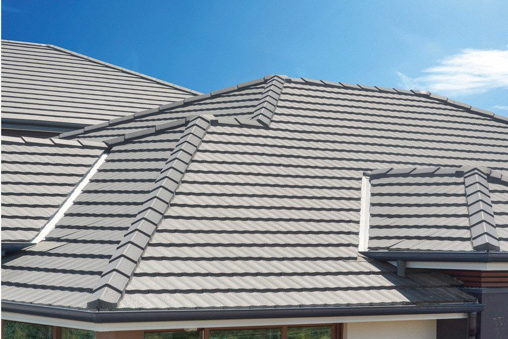
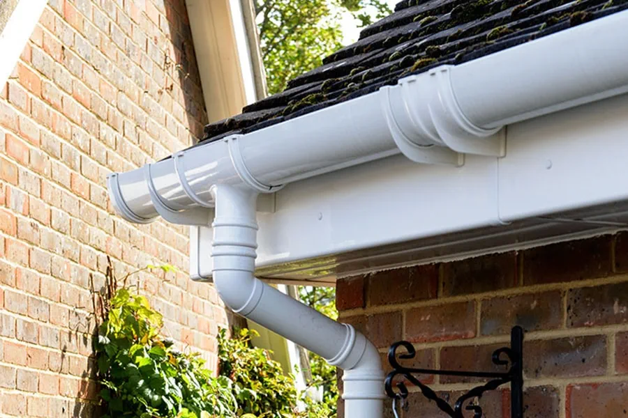

# Usluge

## Građevinski Limar nudi širok spektar usluga za sve vrste krovova, uključujući:

- **Postavljanje krova:** Profesionalna montaža crijepa, lima ili panela za novogradnju.
    

- **Zamjena krova:** Potpuna zamjena krovišta uz prilagodbu potrebama klijenata.
    
    
- **Popravak krova:** Brzo i učinkovito rješavanje curenja ili drugih oštećenja.
        

- **Hidroizolacija:** Dugotrajna zaštita krovova i terasa od prodora vode.
            

- **Izrada potkrovlja:** Projektiranje i izvedba mansardi za proširenje stambenog prostora.
      

- **Stolarija:** Konstrukcija krovišta, uključujući grede i letve.
      

- **Postavljanje oluka i odvodnih cijevi:** Ugradnja i popravak sustava za odvodnju kišnice.
      

**Dodatne usluge:** Montaža dimnjaka, bojanje krova, izolacija i još mnogo toga.

Svaka usluga je prilagođena individualnim potrebama klijenata, uz korištenje vrhunskih materijala i moderne tehnologije. Klijenti mogu računati na dugotrajna rješenja koja osiguravaju sigurnost i estetiku krova.

